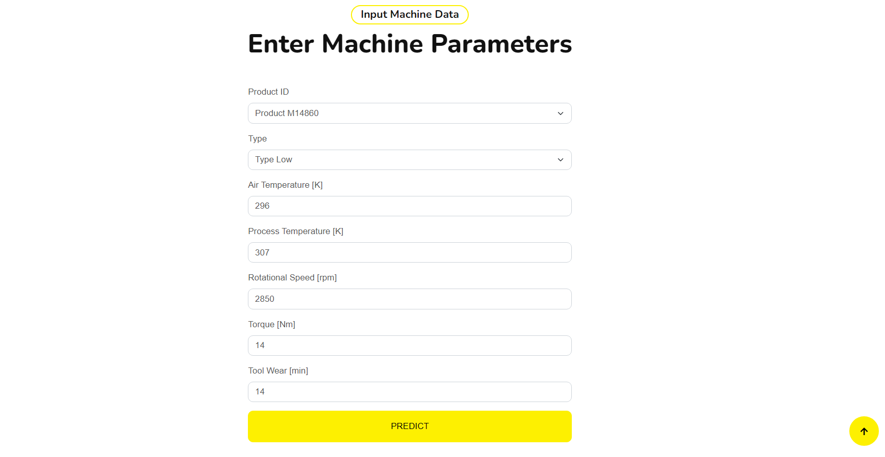

# Machine Failure Prediction Platform

This project is a web application built with Flask for predicting machine failures based on various parameters. Users can input data related to the machine's environment and operation, and the platform predicts whether the machine needs repair or not using a pre-trained machine learning model.


## Features

- **Prediction of Machine Failure:**
  - Uses a machine learning model to predict if a machine needs repair based on input parameters.
- **Interactive Web Interface:**
  - Built with Flask, allowing users to input data, receive predictions, and view results.





- **PDF Report Generation:**
  - Generates a detailed PDF report summarizing input data and prediction results.


- **Pareto chart :**


--> Result :


## Technologies Used

### Backend:

-  **Flask:** Web framework for creating the user interface.
-  **SQLAlchemy:** ORM for database management.
-  **Pickle:** Loading machine learning models.
-  **Matplotlib:** Data visualization library.
-  **ReportLab:** PDF report generation.

### Frontend:

-  **HTML/CSS:** Frontend for user interface design.
-  **JavaScript:** Client-side scripting for interactive features.

### Other Tools:

-  **Pandas:** Data manipulation and analysis.

## Installation

1. **Clone the repository:**
   ```sh
   git clone  https://github.com/SARSARI1/project_DL_predictive_maintenance.git
   cd project_DL_predictive_maintenance

